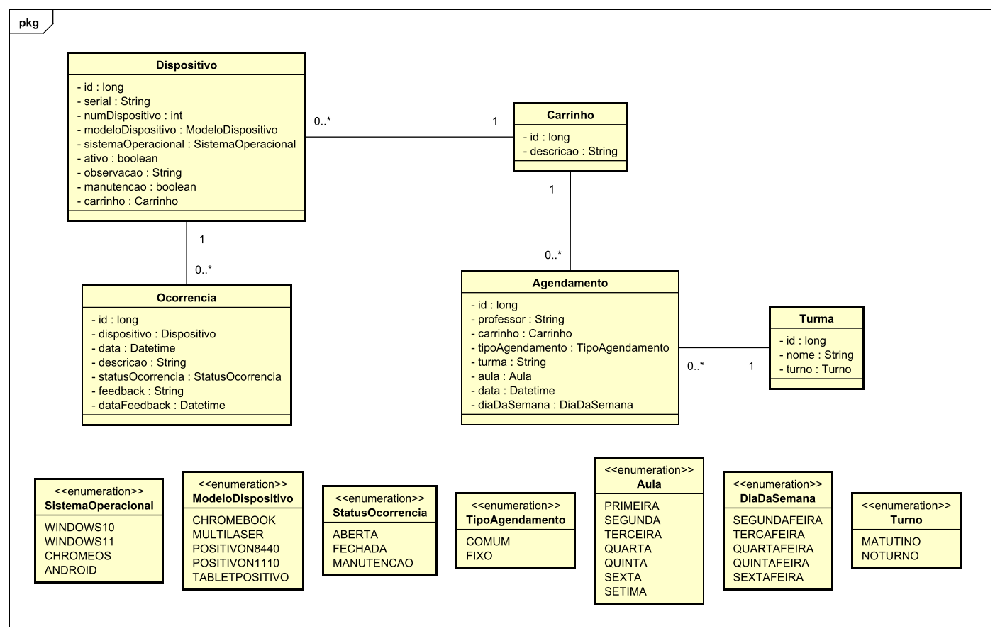

# Gerenciador de Carrinhos

API desenvolvida para a Escola Estadual Comendador Mario Reys com o objetivo de melhorar o fluxo de agendamentos e gestão dos dispositivos e plataformas de carregamento, usando arquitetura limpa e autenticação por níveis de acesso.

## ✨ Principais Funcionalidades

**💻 Gestão de Plataformas e Dispositivos:** Cadastro, vinculação e rastreamento completo de plataformas de carregamento móvel (carrinhos) e dos dispositivos eletrônicos alocados em cada escola.

**📅 Controle de Agendamentos:** Reserva de carrinhos por professores, com atualização em tempo real da disponibilidade dos recursos para evitar conflitos de horários.

**⚠️ Controle de Ocorrências:** Registro e monitoramento detalhado de incidentes com os equipamentos (como avarias, perdas ou necessidade de manutenção), garantindo o histórico de conservação dos ativos.

**🔐 Segurança & Autenticação:** Controle de acesso seguro por perfis de usuários (como administradores da secretaria e professores) via tokens JWT integrados ao Spring Security.

**📑 Documentação Interativa:** API totalmente documentada via Swagger/OpenAPI, permitindo testes rápidos dos endpoints diretamente pelo navegador.

## 🗺️ Modelagem do Sistema

### Diagrama de Classes



## 🛠️ Tecnologias Utilizadas


* **Java:** Linguagem de programação robusta e orientada a objetos utilizada no desenvolvimento da lógica principal da aplicação.
* **Spring Boot:** Framework Java utilizado para acelerar o desenvolvimento da API RESTful, gerenciando injeção de dependências e segurança.
* **Hibernate/JPA:** Framework ORM utilizado para o mapeamento objeto-relacional, abstração de queries do banco de dados e validação de entidades.
* **Spring Security:** Módulo do Spring responsável pelo controle de acesso, gestão de permissões e autenticação segura dos usuários.
* **Swagger (OpenAPI):** Ferramenta utilizada para gerar a documentação interativa da API REST, facilitando testes e integração.
* **PostgreSQL:** Sistema de gerenciamento de banco de dados relacional (SGBD) utilizado para o armazenamento seguro e estruturado dos dados.
* **Docker:** Plataforma de containerização utilizada para padronizar e isolar os ambientes de desenvolvimento e implantação da aplicação.

## 🚀 Como Executar o Projeto

### 📋 Pré-requisitos

* **Git** instalado na sua máquina
* **Docker Desktop** (Windows, macOS ou Linux) rodando

### 🛠️ Passo a Passo

1. **Clonar o repositório:**
```bash
git clone https://github.com/ferreiraluizga/gerenciamento-carrinhos.git
cd gerenciamento-carrinhos
```

2. **Subir os containers (Back-end, Front-end e Banco):**
```bash
docker-compose up --build
```

3. **Acesse a aplicação**
* 📑 Swagger UI (Documentação do Back-End): [http://localhost:8080/swagger-ui/index.html](http://localhost:8080/swagger-ui/index.html)

## 📁 Estrutura do Projeto

```text
gerenciamento-carrinhos
│   core/
│   ├── src/main/java/
│   │   └── com.ferreiraluizga/
│   │       └── smartinventory/
│   │           ├── entities/      # Classes que representam as regras de negócio centrais e objetos de domínio
│   │           ├── enums/         # Enumeradores compartilhados pelo núcleo da aplicação
│   │           ├── exceptions/    # Exceções específicas das regras de negócio
│   │           ├── gateways/      # Interfaces de comunicação com o mundo externo (Portas de saída)
│   │           └── usecases/      # Casos de uso que implementam as regras de negócio da aplicação
│   └── pom.xml
│    
│   infrastructure/
│   ├── src/main/java/
│   │   └── com.ferreiraluizga/
│   │       └── smartinventory/
│   │           ├── config/        # Configurações gerais do ecossistema (Beans, CORS, etc)
│   │           ├── dtos/          # Objetos de transferência de dados (Records/Classes) para a API
│   │           ├── exceptions/    # Manipuladores de erros globais da infraestrutura e API (Ex: `@ControllerAdvice`)
│   │           ├── gateways/      # Implementações das interfaces definidas no Core (Acesso a APIs externas, etc)
│   │           ├── mappers/       # Conversores de objetos (Ex: Mapeamento de Entity para DTO)
│   │           ├── persistence/   # Repositórios e entidades JPA/Banco de dados
│   │           ├── presentation/  # Camada de entrada da API (Controllers REST / Endpoints)
│   │           └── security/      # Configurações de segurança e autenticação (Spring Security, JWT)
│   └── src/main/resources/
│        ├── application.yml        # Propriedades e configurações do ambiente da aplicação
│        └── data.sql               # Script SQL para carga inicial de dados (Seeder)
└── Dockerfile
````
